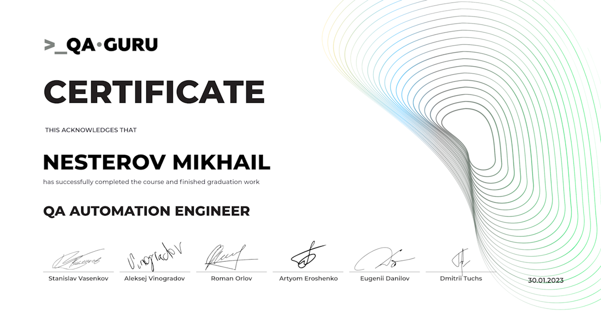
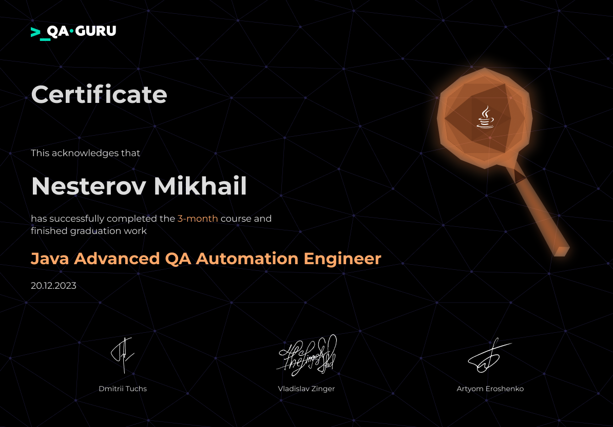

## Hi there 👋

### I'm QA Engineer

### Tools and technologies:

  <code></code>
  <code></code>
  <code></code>
  <code></code>
  <code></code>
  <code></code>
  <code></code>
  <code></code>
  <code></code>
  <code></code>
  <code></code>
  <code></code>
  <code></code>
  <code></code>

### 📱 How to contact me:

## :books: My education of QA automation:

		
<i>QA Automation Engineer (Basic Java level)</i>

		

		
<i>QA Automation Engineer (Advanced Java level)</i>

		

## My business card:
### :heavy_check_mark: UI + GRPC autotests for a self-written microservice application

